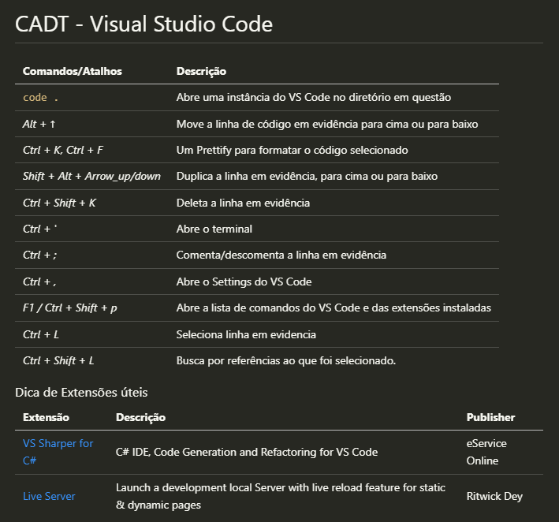

# Comandos - Atalhos - Dicas - Troubleshoots

## **Propósito**

&nbsp;

Este repositório começou como uma ideia de ser um repositório pessoal dedicado a registrar comandos, atalhos de ferramentas, dicas e soluções de problemas que me deparei nas mais diversas ferramentas, e que provavelmente irei esquecer 😬.

Após ver muitas pessoas nos grupos de bootcamps com dificuldades com comandos git, decidi tornar esse repositório mais abrangente e que sirva não só a mim, mas também a comunidade. Dessa forma esse agora passa a ser um **repositório colaborativo**.

&nbsp;

Para cada ocasião/ferramenta será criada uma pasta especifica, contendo um único arquivo `.md` com as descrições e informação necessárias para que possamos compartilhar e reproduzir em caso de necessidade.

&nbsp;

Tentarei manter as informações sempre atualizadas e especificando as versões dos softwares, tentarei 😬.

&nbsp;

## Única regra:
Manter o repositório organizado. 😉

**Exemplo de organização das pastas:**

&nbsp;

**Exemplo de organização dos arquivos `*.md`:**

